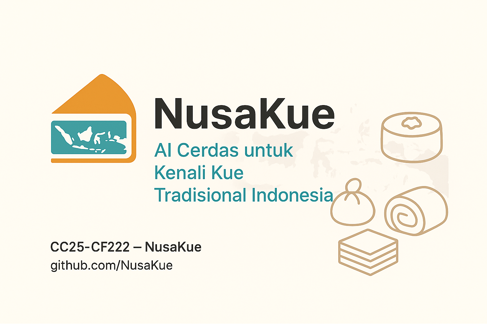

  

# NusaKue Organization

Selamat datang di organisasi **NusaKue**, sebuah komunitas yang berdedikasi melestarikan kue tradisional Indonesia melalui inovasi teknologi AI dan edukasi budaya digital.

Kami mengembangkan berbagai proyek teknologi yang membantu mengenali, mendokumentasikan, dan mempromosikan kue tradisional dari berbagai daerah di Indonesia.

---

## Tentang Proyek NusaKue 🍰

🌟 **Mengenal Budaya Lewat Cita Rasa!**  
NusaKue hadir sebagai solusi modern untuk melestarikan kue tradisional Indonesia melalui teknologi AI.

🚀 Cukup unggah foto, sistem kami akan mengenali jenis kue tradisional beserta informasi budaya di baliknya—nama, daerah asal, cerita, hingga tempat membeli!

📚 Edukasi budaya jadi interaktif, menarik, dan mudah diakses oleh generasi muda.

---

## Capstone Project Coding Camp 2025

| Nama                   | Student ID     | Universitas                     | Peran                      | Kontak LinkedIn                                                                                           |
|------------------------|----------------|--------------------------------|----------------------------|----------------------------------------------------------------------------------------------------------|
| Ady Subagya Junior     | MC006D5Y1412   | Universitas Brawijaya           | Machine Learning Engineer  | [LinkedIn](https://www.linkedin.com/in/adysbgy?utm_source=share&utm_campaign=share_via&utm_content=profile&utm_medium=android_app) |
| Bagus Dzakiy Rahman Saputra | MC378D5Y0356 | Universitas Islam Balitar      | Machine Learning Engineer  | [LinkedIn](https://www.linkedin.com/in/bagusdzakiy/)                                                     |
| Fiyanda Ma'muri        | MC288D5X0264   | Universitas Pamulang            | Machine Learning Engineer  | [LinkedIn](https://www.linkedin.com/in/fiyandamamuri/)                                                  |
| Muhammad Irfan         | FC189D5Y0792   | Universitas Bengkulu            | Frontend/Backend Developer | [LinkedIn](https://www.linkedin.com/in/muhammad-irfan-0ba9b326b/)                                       |
| Revaldo Relinsyah      | FC189D5Y0421   | Universitas Bengkulu            | Frontend/Backend Developer | [LinkedIn](https://www.linkedin.com/in/revaldo-relinsyah-7267012a1/)                                    |
| Sylvia Steffi          | FC827D5X0041   | Universitas Widya Dharma Pontianak | Frontend/Backend Developer | [LinkedIn](https://www.linkedin.com/in/sylvia-steffi-518553320/)                                        |

---

## Project Mentors

> Akan diperbarui nanti oleh panitia Coding Camp 2025.

---

## Timeline

| Tim              | Minggu 1           | Minggu 2               | Minggu 3            | Minggu 4            | Minggu 5            |
|------------------|--------------------|------------------------|---------------------|---------------------|---------------------|
| Machine Learning | Riset & Koleksi Data| Pra-pemrosesan Dataset | Pelatihan Model     | Evaluasi Model      | Deployment Model    |
| Web Development  | Prototyping UI     | Pembangunan Frontend & Backend | Integrasi API & Model | Penambahan Fitur UMKM | Pengujian & Launch |
| UMKM & Konten    | Survei UMKM        | Kurasi Kue Tradisional  | Input Data & Validasi| Optimasi Konten      | Finalisasi & Publikasi|

---

## Ringkasan Proyek

Indonesia memiliki ratusan kue tradisional yang kaya budaya. Sayangnya, dokumentasi dan edukasi mengenai kue-kue ini masih minim, terutama bagi generasi muda.

NusaKue adalah platform berbasis web yang menggunakan teknologi Machine Learning untuk mengenali jenis kue tradisional melalui gambar dan menyajikan informasi budaya serta rekomendasi UMKM lokal yang menjual kue tersebut.

> Fokus awal: Kue dari Jawa Tengah, Jawa Timur, Jawa Barat, Bengkulu, dan Pontianak.

---

## Cara Berkontribusi

Kami terbuka untuk kolaborasi dan kontribusi dari siapa saja yang tertarik melestarikan budaya Indonesia lewat teknologi. Silakan hubungi anggota tim lewat LinkedIn untuk berdiskusi lebih lanjut.

---

## Disclaimer

Proyek ini dikembangkan untuk keperluan edukasi dalam rangka menyelesaikan program **Coding Camp 2025** dan tidak dimaksudkan untuk tujuan komersial.

---

